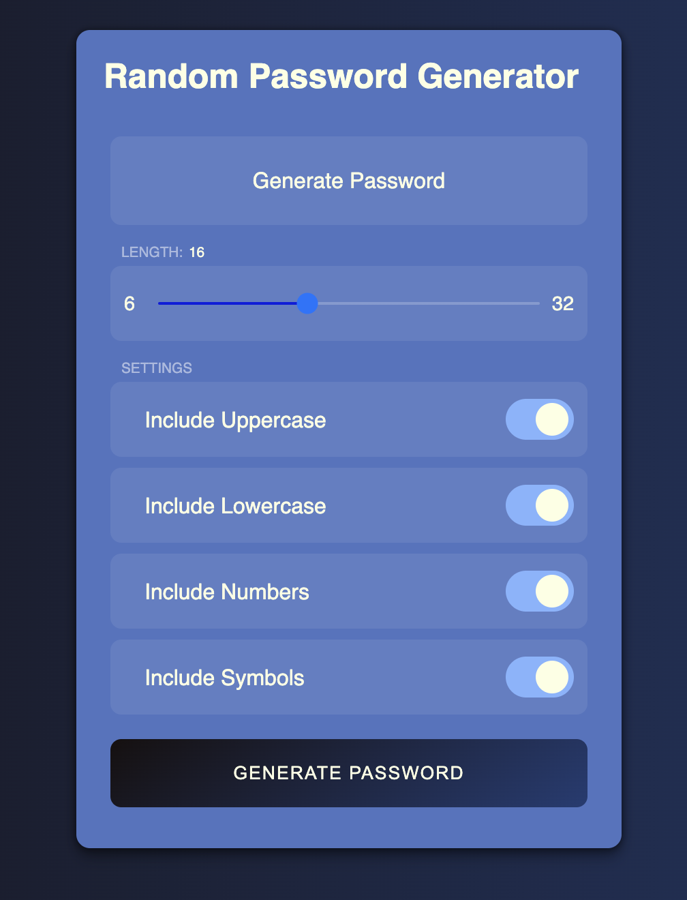

# Random Password Generator

A simple and elegant Password Gnerator built using HTML, CSS, and JavaScript.

## Features

- Generate random passwords of any specified length.
- Include or exclude uppercase letters, lowercase letters, numbers, and special characters.
- Copy the generated password to the clipboard.
- Command-line interface for easy usage.
